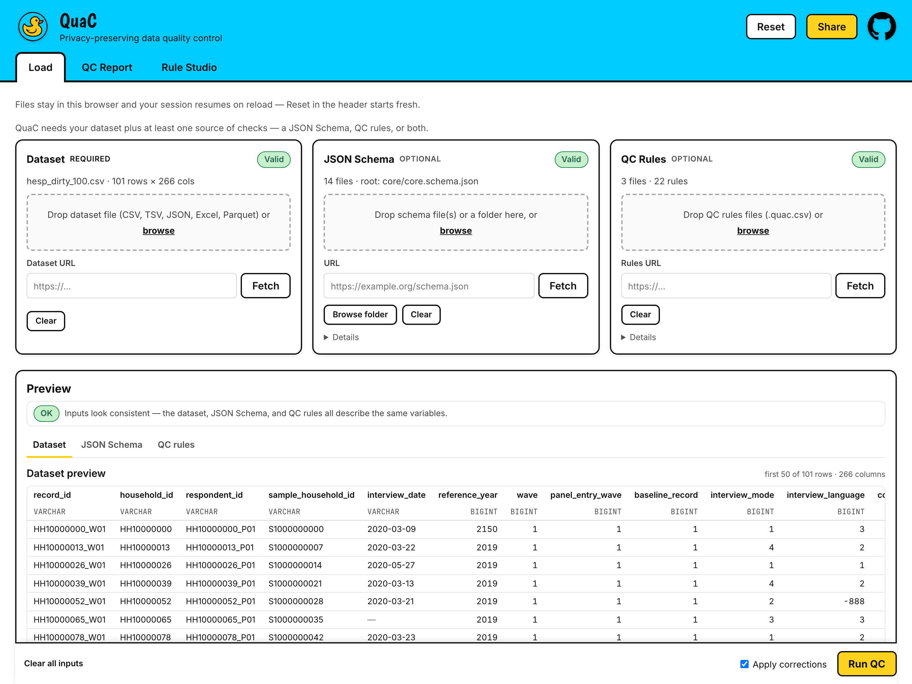
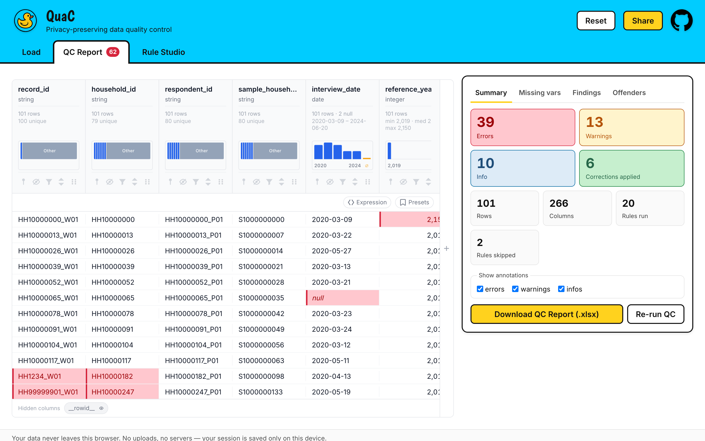
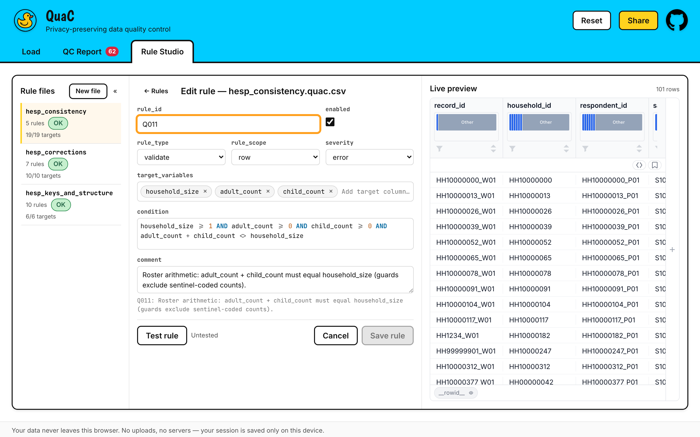

<div align="center">

# QuaC

**Data quality control for tabular data — in your browser, or on your terminal.**

[**Open QuaC →**](https://jeyabbalas.github.io/quac/) · [Rules format](docs/plan/specs/qc-rules-format.md) · [Headless contract](docs/plan/specs/headless.md)

</div>

QuaC checks a dataset against a JSON Schema, a file of QC rules, or both, and hands you a styled
five-sheet Excel report: the data with every problem cell colour-coded, the schema variables that
never arrived, the dataset-level findings, the rules that fired most, and a record of the run.

The web app is **entirely client-side**. Your data is read by JavaScript in your own tab, queried by
a DuckDB engine compiled to WebAssembly, and written back out as a download. There is no server to
send it to. The `quac` CLI is the same pipeline under Node, for the times a report belongs in a
pipeline rather than on a screen.



---

## Quick start

**In the browser.** Open [jeyabbalas.github.io/quac](https://jeyabbalas.github.io/quac/) and press
**Load example files** — that fills all three slots from a 101-row synthetic health-survey dataset
with a 14-file JSON Schema and 22 QC rules, so you can press **Run QC** and read a real report
before committing any of your own data to anything.

With your own data: drop a file into **Dataset**, drop a JSON Schema or a `.quac.csv` rules file
into one of the other two slots, press **Run QC**, then **Download QC Report (.xlsx)**.

**On the command line.**

```sh
npm i -g quac

quac data.csv \
  --schema schemas/ \
  --rules corrections.quac.csv --rules consistency.quac.csv \
  --out reports/ --summary - --fail-on error
```

Node ≥ 24. See [Headless / CLI](#headless--cli) below.

---

## What QuaC needs from you

> **The dataset is required. Everything else is optional — but you need at least one source of
> checks.**

|                 | Required?    | What it does                                                       |
| --------------- | ------------ | ------------------------------------------------------------------ |
| **Dataset**     | **yes**      | The table being checked                                            |
| **JSON Schema** | one of these | Declares types, ranges, enums and required variables, per column   |
| **QC rules**    | one of these | Cross-column logic, assertions and automatic corrections, per rule |

A JSON Schema alone is enough. A rules file alone is enough. Both together is the intended shape:
the schema says what each variable _is_, and the rules say what has to be _true across_ them.

Every surface degrades gracefully. Load only a dataset and you still get a preview of it, with
**Run QC** disabled and a line saying exactly what is missing. Load a schema and no rules and the
report's rule sheets are empty rather than absent. Load rules that mention a column your dataset
does not have and QuaC names them before you run, instead of failing halfway through.

The **Preview** panel below the three slots is the early-warning system: it compares all three
inputs against each other and says so when the dataset, the schema and the rules are not describing
the same variables.

---

## Supported formats

| Format  | Extensions        | Notes                                                        |
| ------- | ----------------- | ------------------------------------------------------------ |
| CSV     | `.csv`            | Delimiter sniffed; every column arrives as text              |
| TSV     | `.tsv`, `.tab`    | As above                                                     |
| JSON    | `.json`           | Must be a top-level array of objects; native types preserved |
| Excel   | `.xlsx`           | See sheet choice below                                       |
| Parquet | `.parquet`, `.pq` | Native types preserved; by far the fastest route             |

Format is decided by **magic bytes first**, then extension, then content — so a Parquet file
someone renamed `.csv` is still read as Parquet rather than as garbage.

**Excel sheet choice.** A single-sheet workbook is used as-is. A workbook with more than one sheet
opens a picker asking which sheet holds the dataset. The CLI cannot ask, so it refuses with exit 2
and prints every sheet name — name one with `--sheet`.

**Size.** Files over 100 MB warn that the run will be slow; QuaC refuses above 500 MB to keep the
browser responsive. Parquet is dramatically smaller than the same data as CSV, and if you are
anywhere near these numbers it is the format to use.

---

## Schema checks vs. QC rules

**Use a JSON Schema for anything a single variable can be judged by on its own** — its type, its
range, its enumerated values, its string pattern, whether it is required. That is what JSON Schema
is for, the vocabulary is standard, and a schema you already maintain for an API or a data
dictionary works here unchanged. QuaC resolves `$ref`s across a whole folder of schema files and
tells you which one it picked as the root.

**Use a QC rules file for everything else**: conditions that span columns, checks that need the
whole column at once, findings about the dataset as a whole, longitudinal comparisons between a row
and its predecessor, and any correction you want applied automatically.

---

## The `.quac.csv` rules file

A QC rules file is an ordinary CSV with ten columns. Any `.csv` is accepted; `.quac.csv` is the
convention QuaC writes back out and the one the UI suggests.

```csv
rule_id,rule_type,rule_scope,target_variables,condition,update_language,update_expression,severity,comment,enabled
R003,validate,column,age,"in_range(0, 120)",,,error,Age outside the plausible 0-120 range.,true
R006,correct,row,city,"city IS NOT NULL AND city <> UPPER(city)",sql,UPPER(city),info,City normalized to uppercase per convention.,true
```

### The ten columns

| Column              | Required | Accepts                                                                         |
| ------------------- | -------- | ------------------------------------------------------------------------------- |
| `rule_id`           | yes      | `[A-Za-z][A-Za-z0-9_-]*`, unique across **every** loaded rules file             |
| `rule_type`         | yes      | `validate` · `correct` · `external`                                             |
| `rule_scope`        | yes      | `row` · `column` · `dataset` · `longitudinal`                                   |
| `target_variables`  | yes\*    | Pipe-separated column names: `adult_count\|child_count`                         |
| `condition`         | yes      | A SQL boolean expression, an assertion, or a `SELECT` — by scope, see below     |
| `update_language`   | no       | `sql` (default) · `js`                                                          |
| `update_expression` | no\*\*   | The new value, for `correct` rules                                              |
| `severity`          | no       | `error` · `warning` · `info` — defaults to `info` for corrections, else `error` |
| `comment`           | yes      | The sentence a reader of the report sees. Blank warns and generates a fallback  |
| `enabled`           | no       | `true`/`yes`/`1` or `false`/`no`/`0`; defaults to `true`                        |

\* Required for `validate` and `correct` at `row`, `column` and `longitudinal` scope; optional at
`dataset` scope and for `external` rules.
\*\* Required for `correct`; must be **empty** for `validate`.

### `condition` selects the rows the rule acts on

This is the one thing worth getting right on the first read:

> **`condition` is true on the rows you want to hear about**, not on the rows that are fine.

For a `validate` rule, write the expression that describes the _broken_ case. For a `correct` rule,
write the expression that describes the rows _needing the fix_. Plain SQL `WHERE` truthiness, so
`NULL` is not selected.

```
✅  adult_count + child_count <> household_size    flags the rows where the roster does not add up
❌  adult_count + child_count =  household_size    flags every row that is CORRECT
```

Column-scope assertions read the other way round — `no_nulls` sounds like a property you _want_ —
but they expand internally into exactly this violation form, so the rule is unbroken.

### Rule types and scopes

| Type       | What it does                                                                         |
| ---------- | ------------------------------------------------------------------------------------ |
| `validate` | Flags findings. Never touches your data.                                             |
| `correct`  | Rewrites the target values, and flags every cell it changed with before → after.     |
| `external` | Needs reference data QuaC does not have. Loaded and listed in the report, never run. |

|            | `row` | `longitudinal` | `column` | `dataset` |
| ---------- | :---: | :------------: | :------: | :-------: |
| `validate` |  ✅   |       ✅       |    ✅    |    ✅     |
| `correct`  |  ✅   |       ✅       |    ❌    |    ❌     |
| `external` |  ✅   |       ✅       |    ✅    |    ✅     |

A `correct` rule cannot be `column`-scoped — use `row` scope with `__value__`.

### The eight column assertions

At `column` scope, `condition` is one assertion rather than raw SQL:

| Assertion                         | Arguments                                                                                                       |
| --------------------------------- | --------------------------------------------------------------------------------------------------------------- |
| `unique`                          | none                                                                                                            |
| `no_nulls`                        | none                                                                                                            |
| `not_blank`                       | none                                                                                                            |
| `in_range(lo, hi)`                | two numbers or quoted strings                                                                                   |
| `in_enum(v1, …)`                  | one or more numbers or quoted strings                                                                           |
| `match_regex('pattern')`          | one quoted string                                                                                               |
| `monotonic(direction, …)`         | `increasing`\|`strict_increasing`\|`decreasing`\|`strict_decreasing`, plus optional `order_by=`/`partition_by=` |
| `count_distinct_in_range(lo, hi)` | two numbers                                                                                                     |

The full grammar, the exact SQL each assertion expands to, and the `js` correction sandbox are in
**[docs/plan/specs/qc-rules-format.md](docs/plan/specs/qc-rules-format.md)**.

---

## The report



On screen you get counts, four panels (Summary, Missing vars, Findings, Offenders) and the dataset
itself with every flagged cell coloured by severity. **Download QC Report (.xlsx)** writes five
sheets:

| Sheet                 | What is in it                                                                                            |
| --------------------- | -------------------------------------------------------------------------------------------------------- |
| **Data**              | Your data after corrections, with a `<column>__review` note column beside every column that has findings |
| **Missing Variables** | Variables the schema declares that the dataset never provided                                            |
| **Dataset Findings**  | Dataset- and column-scope findings, plus every rule that was broken, skipped or external                 |
| **Repeat Offenders**  | Every rule that fired, worst first, with exact counts and the share of rows affected                     |
| **Run Info**          | Version, timestamp, inputs, per-stage timings, corrections applied, caps in effect                       |

The report is generated fresh each time and never stored anywhere.

---

## Rule Studio



Rule Studio is where rules get written rather than merely run. It gives you a form per rule with a
CodeMirror editor for the condition and the update expression, SQL and JavaScript syntax
highlighting, a live preview of the dataset beside the rule, per-rule lint, and **Test rule** —
which executes the rule against your loaded data and shows what it would flag, before it is part of
a run. Edited rules download as a `.quac.csv` you can commit next to your data.

---

## Loading inputs from URLs

Every input slot accepts a URL as well as a file, and the whole set can be encoded in a link. The
**Share** button builds it for you.

```
https://jeyabbalas.github.io/quac/#/load?schema=<url>&rules=<url>&rules=<url>&data=<url>
```

| Parameter | Repeatable | Meaning                                                                    |
| --------- | ---------- | -------------------------------------------------------------------------- |
| `data`    | no         | The dataset URL                                                            |
| `schema`  | **yes**    | Schema crawl bases; `$ref`s are followed from there                        |
| `rules`   | **yes**    | Rules files — **order is correction order**                                |
| `index`   | no         | Which schema file is the root, when several could be. Written for you      |
| `config`  | no         | A JSON manifest holding all of the above, for links past ~2,000 characters |

Values are URL-encoded, and unrecognized parameters are preserved rather than dropped. **Opening
such a link never auto-runs QC** — it fills the slots and waits for you.

### Which hosts work?

A URL load is a browser `fetch`, so the host has to send `Access-Control-Allow-Origin`. Re-verified
2026-07-30:

| Host                         |     | Note                                                                        |
| ---------------------------- | :-: | --------------------------------------------------------------------------- |
| `raw.githubusercontent.com`  | ✅  | GitHub raw file URLs — `*`                                                  |
| `gist.githubusercontent.com` | ✅  | GitHub gist raw URLs — `*`                                                  |
| `cdn.jsdelivr.net`           | ✅  | jsDelivr, including its `/gh/` GitHub mirror — `*`                          |
| `api.github.com`             | ✅  | GitHub API — `*`                                                            |
| OSF                          | ❌  | Sends no `Access-Control-Allow-Origin`                                      |
| Zenodo                       | ⚠️  | Sent `*` when last checked, but has been inconsistent — treat as unreliable |

When a fetch is refused you get a message naming the host, the advice that the server may not permit
browser access, and a **Retry** button — and the fallback always works: download the file and drop
it in.

**None of this applies to the CLI.** CORS is a browser rule. A URL the web app cannot reach for want
of a header loads fine under `quac --schema` / `--rules`.

---

## Privacy

**In the browser.** After the page loads, QuaC makes no third-party request at all. No analytics, no
telemetry, no runtime CDN, no upload — DuckDB's WebAssembly build and its extensions are served from
this site rather than fetched from `extensions.duckdb.org`, and the worker that executes rule SQL
has its network removed at the platform level. You can watch this in DevTools' Network tab; it is
also asserted by an end-to-end test that fails the build if a single off-origin request is made
during a full run.

**What does stay on your device.** QuaC keeps your loaded **inputs** in this browser's IndexedDB, so
that reloading the tab does not cost you the work of setting the run up again: the dataset's
original bytes, the schema and rules text, your Rule Studio work, and the Apply-corrections toggle.
That is storage on your own machine, not a server — but it is not nothing, and it does not expire on
its own.

- **Reset** in the header, or **Clear all inputs** at the bottom of the Load view, wipes it. Both
  confirm first, and both remove the saved session as well as the loaded slots.
- The **QC report is never stored.** It is built in memory and handed to your downloads folder.
- A restored session **never re-runs QC by itself**. Computing is always something you asked for.

**On the command line**, the promise is the same one, kept the same way: data stays on the machine
that ran it. An ordinary local process reads the files you name and writes the report next to your
data. The only network requests it can make are for the `--schema` and `--rules` URLs you passed it
yourself. Nothing persists between runs: the only things written are the report and, if you ask for
it, the summary.

**The residual risk QuaC cannot remove** is denial of service, not disclosure. A rules file is
executable content: a hostile or careless `condition` — an accidental cross-join is the classic —
can spin the engine, exhaust memory, or hang the tab. QuaC bounds what it can: JavaScript
corrections run in a QuickJS WebAssembly sandbox with an interrupt deadline and no host access, SQL
runs in a worker with the network removed at the platform level, rules loaded from a URL raise a
banner saying so, and every stage is capped. But cancellation is cooperative — the engine checks for
it between rules, not inside a running query — so a single sufficiently expensive statement will
still run to completion. Treat a rules file from a stranger the way you would treat a script from a
stranger.

---

## Headless / CLI

The same pipeline under plain Node, for data pipelines that want the QC report without a browser:
ingest → schema validation → QC rules and corrections → the styled five-sheet `.xlsx`.

```sh
npm i -g quac        # or run it once with: npx quac ...
```

```
quac <dataset> [--schema <file|dir|url>]... [--rules <file|url>]...
     [--index <id>] [--sheet <name>] [--out <path>] [--no-corrections]
     [--summary <path|->] [--fail-on <error|warning|none>] [--quiet]
quac --version
quac --help
```

`--schema` and `--rules` are both repeatable. **Argument order is correction order** — rules files
are applied in the order you name them, so a correction in the second file sees the first file's
output. A `--schema` value may be a file, a directory (read recursively, like a folder drop) or a
URL, but all of them must be the same kind, never a mix.

### Exit codes

| Exit | Meaning                                                                                                                 |
| ---- | ----------------------------------------------------------------------------------------------------------------------- |
| 0    | Report written                                                                                                          |
| 1    | Usage error — bad flags, no dataset, no source of checks                                                                |
| 2    | Input error — unreadable, unsupported or oversize dataset; a multi-sheet workbook with no `--sheet`; a failed URL fetch |
| 3    | Schema-set error — fatal load errors, or a root left ambiguous without a matching `--index`                             |
| 4    | Run failure                                                                                                             |
| 5    | The report or the summary could not be written                                                                          |
| 6    | `--fail-on` threshold met — **the report and summary were still written first**                                         |
| 130  | Interrupted                                                                                                             |

### Two recipes

**Gate a pipeline on findings.** `--fail-on error` exits 6 when the run produced any error-severity
finding — after writing the report, so the artifact exists to look at:

```sh
quac data.parquet --schema schema/ --rules qc.quac.csv --out reports/ --fail-on error \
  || echo "QC failed — see reports/"
```

`--fail-on warning` trips on errors _or_ warnings. The default, `none`, means findings never affect
the exit code.

**Machine-readable output.** `--summary -` writes the run record as JSON to stdout, which then
carries nothing else — every progress line, warning and error goes to stderr, so a pipe is always
clean:

```sh
quac data.csv --rules qc.quac.csv --summary - --quiet \
  | jq '{errors: .severityTotals.error,
         rows: .rowsAffected,
         worst: (.perRule | max_by(.violationCount) | .ruleId)}'
```

The summary carries per-rule counts and statuses (in rule order, with exact violation counts even
where a cap truncated the flags), per-stage durations, the schema results, the missing variables,
and the exit code the process is about to use. Its shape is versioned (`summarySchemaVersion`):
fields may be added within a version, never removed or renamed.

### As a library

```js
import { runQuac, buildSummary } from 'quac';

const result = await runQuac({
  dataset: 'data.csv',
  schema: ['schema/'],
  rules: ['corrections.quac.csv', 'consistency.quac.csv'],
  out: 'reports/',
  onProgress: (p) => console.error(`${p.stage} ${p.done}/${p.total}`),
});

console.log(result.outPath);
const summary = buildSummary(result, {
  quacVersion: '1.0.0',
  exitCode: 0,
  generatedAt: new Date().toISOString(),
});
```

Types ship with the package ([`types/quac.d.ts`](types/quac.d.ts)). `quac --help` documents every
flag; the full contract is in **[docs/plan/specs/headless.md](docs/plan/specs/headless.md)**.

Node ≥ 24 is the declared floor. Node 20–23 runs with a warning; below 20 it refuses.

---

## Local development

```sh
git clone https://github.com/jeyabbalas/quac.git
cd quac
npm ci
npm run dev
```

> **Do not install with `--omit=dev`.** The published package's `dependencies` are only the eight
> the CLI actually imports; the entire web toolchain — Vite, duckdb-wasm, CodeMirror, the data grid
> — lives in `devDependencies` deliberately, so that `npm i -g quac` does not download a browser app
> onto a server. Building the web app needs them.

| Command                 | What it does                                          |
| ----------------------- | ----------------------------------------------------- |
| `npm run dev`           | Vite dev server                                       |
| `npm run build`         | Production build into `dist/`                         |
| `npm run cli -- <args>` | Build and run the CLI in one step                     |
| `npm run verify`        | Typecheck, lint, unit tests — the pre-commit gate     |
| `npm test`              | Unit tier                                             |
| `npm run test:browser`  | Browser tier (real DuckDB-WASM, headless Chromium)    |
| `npm run test:cli`      | CLI tier, against the built binary                    |
| `npm run test:e2e`      | Playwright end-to-end, including the performance gate |
| `npm run screenshots`   | Regenerate the images in this README                  |

The first `npm run dev` or `npm run build` downloads ~20 MB of DuckDB WebAssembly extensions into
the gitignored `public/duckdb/`, pinned by SHA-256.

Requirements are in [docs/BRIEF.md](docs/BRIEF.md); design and implementation notes in
[docs/plan/specs/](docs/plan/specs/).

---

## Limitations

Worth knowing before you rely on it:

- **`external` rules are listed, not executed.** A rule whose `rule_type` is `external` needs
  reference data QuaC does not have. It is parsed, reported and counted as skipped — never run, even
  when `enabled` is true.
- **A rules-only run sees every column as text.** Without a JSON Schema there is nothing to type the
  columns from, so they all arrive `VARCHAR`, and DuckDB will not compare or do arithmetic on
  untyped text: `age > 120` simply fails to bind. Write `TRY_CAST(age AS DOUBLE) > 120`, or load a
  schema. Rules that cannot execute are excluded by lint, with a message naming the column and
  suggesting the cast, rather than silently producing nothing. Rules that need no numeric
  coercion — `unique`, `match_regex`, `no_nulls`, string functions — are unaffected. On the bundled
  example, dropping the schema excludes 12 of the 22 rules.
- **Column headers are matched case-sensitively.** `Age` in the schema and `age` in the data are two
  different variables. QuaC warns about the near-miss rather than guessing, but the consequence is
  real: that column is neither validated against its schema property nor type-cast for numeric
  rules.
- **Chromium is the only browser QuaC is tested against.** It needs WebAssembly, Web Workers and ES
  modules (IndexedDB is used only for session persistence, and its absence degrades gracefully).
  There is no automated Firefox or Safari coverage, and no in-app detection: a browser that cannot
  run it will fail with a generic error rather than a clear "unsupported browser" message.
- **CSV is much slower than Parquet, and has a real ceiling.** Delimited text is parsed in the page
  and routed through JSON, which puts a practical limit somewhere around
  `rows × columns × row-size ≈ 10⁹`. A 100,000 × 20 Parquet file runs end to end in seconds; the
  same data as CSV will not get there. Convert first if you can.
- **The Excel report's data sheet truncates at 1,048,575 rows** — Excel's own limit. Every row is
  still validated and every finding still counted; both that sheet and Run Info say what was cut.
- **A run is capped, and says so.** At most 10,000 violating rows are individually flagged per rule
  (200 for a dataset-scope rule) and 200,000 flags are materialized per run. Exact counts survive
  the caps — the Repeat Offenders sheet and the summary panel report the true totals either way. The
  on-screen grid additionally paints at most 20,000 cell highlights, with a banner saying how many
  there were; the Excel report is not limited by that figure. Every cap in force is written into the
  Run Info sheet.
- **Keyboard navigation of the data grid can trap focus.** The grid is a third-party component and in
  some states <kbd>Tab</kbd> does not leave it — an upstream issue, and not one automated
  accessibility tooling can detect. Reload if you get stuck.
- **`xlsx` installs from a CDN, not from npm.** SheetJS stopped publishing to the npm registry, so
  installing `quac` fetches one pinned, hash-verified tarball from `cdn.sheetjs.com`. Behind a
  registry mirror or an allowlisting proxy, that install step will fail.

---

## License

[MIT](LICENSE) © Jeya Balaji Balasubramanian
